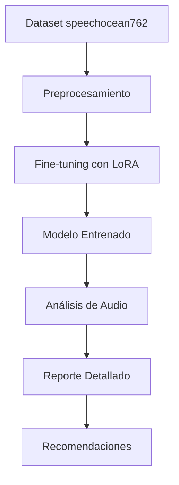

# 🎯 Whisper Pronunciation Tuning


Un sistema completo de fine-tuning de Whisper para análisis de pronunciación en inglés usando el dataset speechocean762. Este proyecto entrena un modelo de IA generativa que puede detectar y ayudar a corregir errores de pronunciación en inglés, proporcionando análisis detallado con puntuaciones específicas y recomendaciones personalizadas.

## 🌟 Características Principales

- **🔥 Fine-tuning eficiente** de Whisper usando LoRA (Low-Rank Adaptation)
- **📊 Análisis multi-nivel**: sentence-level, word-level, y phoneme-level
- **🎯 Detección de errores específicos** de pronunciación con localizaciones precisas
- **💡 Recomendaciones personalizadas** para mejora de pronunciación
- **⚡ Interfaz de línea de comandos** fácil de usar
- **📈 Visualizaciones interactivas** de resultados
- **🔄 Procesamiento en lote** de múltiples archivos de audio
- **🚀 Optimización de memoria** con Accelerate y LoRA
- **📱 Demo interactivo** con interface web

## 📊 Dataset: speechocean762

Este proyecto utiliza [speechocean762](https://huggingface.co/datasets/mispeech/speechocean762), un dataset open-source diseñado específicamente para evaluación de pronunciación:

| Característica | Detalle |
|---|---|
| **Utterances** | 5,000 grabaciones en inglés |
| **Hablantes** | 250 hablantes no nativos |
| **Niveles de análisis** | Sentence, Word, Phoneme |
| **Métricas** | Accuracy, Fluency, Completeness, Prosody |
| **Anotaciones** | Expertas con información de mispronunciaciones |

## 🚀 Instalación

### Requisitos del Sistema

- **Python** 3.11+
- **CUDA-compatible GPU** (recomendado para entrenamiento)
- **RAM** 16GB+ (32GB+ recomendado para modelos grandes)
- **Espacio en disco** 10GB+ para modelos y cache

### Instalación con uv (Recomendado)

```bash
# Clonar el repositorio
git clone https://github.com/tu-usuario/whisper-pronunciation-tuning.git
cd whisper-pronunciation-tuning

# Instalar dependencias con uv
uv sync

# Activar el entorno virtual
source .venv/bin/activate  # Linux/Mac
# o
.venv\Scripts\activate     # Windows
```

### Instalación Alternativa con pip

```bash
# Instalar en modo desarrollo
pip install -e .

# O desde requirements
pip install -r requirements.txt
```

### Verificar Instalación

```bash
# Verificar CUDA
python check_cuda.py

# Probar el sistema
python main.py test-data
```

## 📖 Guía de Uso

### 1. 🏋️ Entrenamiento del Modelo

#### Entrenamiento Básico (Recomendado)

```bash
# Configuración inicial para principiantes
uv run python main.py train --epochs 5 --batch-size 2
```

#### Entrenamiento Avanzado

```bash
# Configuración completa con parámetros optimizados
uv run python main.py train \
    --model-name openai/whisper-base \
    --epochs 10 \
    --batch-size 4 \
    --learning-rate 1e-4 \
    --lora-r 32 \
    --lora-alpha 64 \
    --gradient-accumulation-steps 8
```

#### Parámetros de Entrenamiento

| Parámetro | Descripción | Valores Recomendados |
|---|---|---|
| `--model-name` | Modelo base de Whisper | `whisper-small`, `whisper-base`, `whisper-large` |
| `--epochs` | Número de épocas | 5-15 |
| `--batch-size` | Tamaño de lote | 2-8 (según GPU) |
| `--learning-rate` | Tasa de aprendizaje | 5e-5 a 2e-4 |
| `--lora-r` | Rank de LoRA | 16-64 |
| `--lora-alpha` | Alpha de LoRA | 32-128 |
| `--gradient-accumulation-steps` | Acumulación de gradiente | 4-16 |

### 2. 🎵 Análisis de Pronunciación

#### Archivo Individual

```bash
# Análisis básico
uv run python main.py analyze --audio-file mi_audio.wav

# Con directorio de salida personalizado
uv run python main.py analyze \
    --audio-file mi_audio.wav \
    --output-dir ./mis_resultados
```

#### Procesamiento en Lote

```bash
# Analizar directorio completo
uv run python main.py analyze \
    --audio-dir ./audios \
    --output-dir ./resultados
```

#### Formatos de Audio Soportados

- **WAV** (recomendado)
- **MP3**
- **FLAC**
- **OGG**
- **M4A**

### 3. 🧪 Demos y Pruebas

```bash
# Demostración interactiva
uv run python demo_inference.py

# Demo sin visualizaciones
uv run python demo_inference.py --no-visualizations

# Probar cargador de datos
uv run python main.py test-data

# Información del modelo
uv run python main.py info
```

## 📋 Ejemplo de Salida

### Análisis Completo

```
============================================================
🎯 REPORTE DE ANÁLISIS DE PRONUNCIACIÓN
============================================================

📝 TRANSCRIPCIÓN: "The quick brown fox jumps over the lazy dog"

📊 PUNTUACIONES GENERALES:
   • 🎯 Precisión General: 7.5/10
   • 📈 Precisión: 8.0/10
   • 🌊 Fluidez: 7.0/10
   • ✅ Completitud: 0.9/1.0
   • 🎵 Prosodia: 7.5/10

⚠️  ERRORES A NIVEL DE PALABRAS:
   • "quick" → 6.2/10
     └─ Dificultad con el sonido 'qu' inicial
   • "jumps" → 7.1/10
     └─ Pronunciación de la 's' final unclear

🔊 ERRORES DE FONEMAS:
   • Palabra "quick": /k/ → /g/ (oclusiva sorda → sonora)
   • Palabra "jumps": /s/ → <unk> (sonido final no reconocido)

💡 RECOMENDACIONES PERSONALIZADAS:
   1. 🎯 Practica las oclusivas sordas (/k/, /p/, /t/)
   2. 🌊 Trabaja en la fluidez evitando pausas largas
   3. 🔚 Enfócate en las consonantes finales
   4. 🎵 Mejora la entonación natural del inglés

🎯 Confianza del análisis: 85.3%
⏱️  Tiempo de procesamiento: 2.3s
============================================================
```

## 🏗️ Arquitectura del Proyecto

### Estructura de Directorios

```
whisper-pronunciation-tuning/
├── 📁 cache/                    # Cache de datasets y modelos
├── 📁 logs/                     # Logs de entrenamiento
├── 📁 analysis_results/         # Resultados de análisis
├── 📁 whisper-pronunciation-tuned/ # Modelos entrenados
├── 📄 main.py                   # Interfaz principal CLI
├── 📄 data_loader.py           # Cargador de speechocean762
├── 📄 whisper_pronunciation_trainer.py # Entrenador con LoRA
├── 📄 pronunciation_analyzer.py # Analizador de pronunciación
├── 📄 demo_inference.py        # Demo interactivo
├── 📄 check_cuda.py            # Verificador de CUDA
└── 📄 pyproject.toml           # Configuración del proyecto
```

### Componentes Principales

| Componente | Función |
|---|---|
| **data_loader.py** | Carga y preprocesamiento del dataset speechocean762 |
| **whisper_pronunciation_trainer.py** | Fine-tuning de Whisper con LoRA |
| **pronunciation_analyzer.py** | Análisis de pronunciación en tiempo real |
| **main.py** | Interfaz principal de línea de comandos |
| **demo_inference.py** | Demostración interactiva con visualizaciones |

### Flujo de Trabajo



## ⚙️ Configuración Avanzada

### Optimización para Diferentes GPUs

#### GPU con 8GB+ (RTX 3070, RTX 4060 Ti)

```bash
uv run python main.py train \
    --model-name openai/whisper-small \
    --batch-size 4 \
    --gradient-accumulation-steps 4 \
    --lora-r 32 \
    --fp16
```

#### GPU con 16GB+ (RTX 4080, RTX 4090)

```bash
uv run python main.py train \
    --model-name openai/whisper-base \
    --batch-size 8 \
    --gradient-accumulation-steps 2 \
    --lora-r 64 \
    --fp16
```

#### GPU con 24GB+ (RTX 6000, A6000)

```bash
uv run python main.py train \
    --model-name openai/whisper-large \
    --batch-size 16 \
    --gradient-accumulation-steps 1 \
    --lora-r 128 \
    --fp16
```

### Configuración LoRA por Modelo

```python
# Configuraciones recomendadas
WHISPER_SMALL = {
    "lora_r": 32,
    "lora_alpha": 64,
    "lora_dropout": 0.1,
    "batch_size": 4
}

WHISPER_BASE = {
    "lora_r": 64,
    "lora_alpha": 128,
    "lora_dropout": 0.1,
    "batch_size": 6
}

WHISPER_LARGE = {
    "lora_r": 128,
    "lora_alpha": 256,
    "lora_dropout": 0.05,
    "batch_size": 8
}
```

## 📈 Métricas de Evaluación

### Métricas Principales

| Métrica | Descripción | Rango |
|---|---|---|
| **WER** | Word Error Rate - Tasa de errores de palabras | 0.0-1.0 (menor es mejor) |
| **BLEU** | Calidad de generación de texto | 0.0-1.0 (mayor es mejor) |
| **Accuracy** | Precisión de pronunciación | 0-10 |
| **Fluency** | Fluidez del habla | 0-10 |
| **Completeness** | Completitud de pronunciación | 0-1 |
| **Prosody** | Calidad prosódica | 0-10 |

### Interpretación de Resultados

- **8.0-10.0**: Pronunciación excelente
- **6.0-7.9**: Pronunciación buena con áreas de mejora
- **4.0-5.9**: Pronunciación promedio, necesita práctica
- **0.0-3.9**: Pronunciación necesita trabajo significativo

## 🎨 Visualizaciones

El sistema incluye visualizaciones automáticas:

- **📊 Gráficos de barras** de puntuaciones por categoría
- **🔥 Mapas de calor** de métricas múltiples
- **📋 Análisis de errores** por palabra y fonema
- **📈 Tendencias de mejora** a lo largo del entrenamiento
- **🎯 Matrices de confusión** para clasificación de fonemas

## 🔧 Troubleshooting

### Problemas Comunes

#### 1. Error de Memoria GPU

```bash
# Síntoma: "CUDA out of memory"
# Solución: Reducir batch size
uv run python main.py train --batch-size 1 --gradient-accumulation-steps 16

# O usar CPU (muy lento)
CUDA_VISIBLE_DEVICES="" uv run python main.py train --epochs 1
```

#### 2. Dataset No Encontrado

```bash
# Síntoma: "Dataset not found"
# Solución: El dataset se descarga automáticamente
# Asegúrate de tener:
# - Conexión a internet
# - Espacio en disco (5GB+)
# - Permisos de escritura en ./cache
```

#### 3. Modelo No Encontrado para Análisis

```bash
# Síntoma: "Model not found"
# Solución: Entrena el modelo primero
uv run python main.py train --epochs 5 --batch-size 2

# Verifica que existe el directorio
ls -la ./whisper-pronunciation-tuned/
```

#### 4. Problemas de Transformers

```bash
# Síntoma: "evaluation_strategy not found"
# Solución: Actualizar transformers
pip install --upgrade transformers>=4.35.0

# O usar uv
uv add transformers@latest
```

#### 5. Problemas con CUDA

```bash
# Verificar instalación CUDA
python check_cuda.py

# Reinstalar PyTorch con CUDA
pip uninstall torch torchvision torchaudio
pip install torch torchvision torchaudio --index-url https://download.pytorch.org/whl/cu121
```

### Logs y Debugging

```bash
# Habilitar logging detallado
export PYTHONPATH=.
export CUDA_LAUNCH_BLOCKING=1
uv run python main.py train --epochs 1 --batch-size 1 --verbose

# Verificar uso de memoria
watch -n 1 nvidia-smi
```

## 🤝 Contribución

¡Las contribuciones son bienvenidas! Por favor:

1. **Fork** el repositorio
2. **Crear** una rama para tu feature (`git checkout -b feature/nueva-funcionalidad`)
3. **Commit** tus cambios (`git commit -am 'Agrega nueva funcionalidad'`)
4. **Push** a la rama (`git push origin feature/nueva-funcionalidad`)
5. **Crear** un Pull Request

### Desarrollo

```bash
# Instalar dependencias de desarrollo
uv add --dev pytest black isort flake8

# Ejecutar tests
uv run pytest

# Formatear código
uv run black .
uv run isort .

# Linting
uv run flake8 .
```

## 📄 Licencia

Este proyecto está bajo la licencia MIT. Ver el archivo `LICENSE` para más detalles.

## 🙏 Agradecimientos

- **OpenAI** por el modelo Whisper
- **Hugging Face** por transformers y datasets
- **speechocean762** por el dataset de pronunciación
- **Microsoft** por el framework LoRA (PEFT)

## 📞 Soporte

Si tienes problemas:

1. Revisa la sección **Troubleshooting**
2. Busca en los **Issues** existentes
3. Crea un **nuevo Issue** con:
   - Descripción del problema
   - Logs de error
   - Información del sistema
   - Pasos para reproducir

---

**¡Hecho con ❤️ para la comunidad de aprendizaje de idiomas!**
